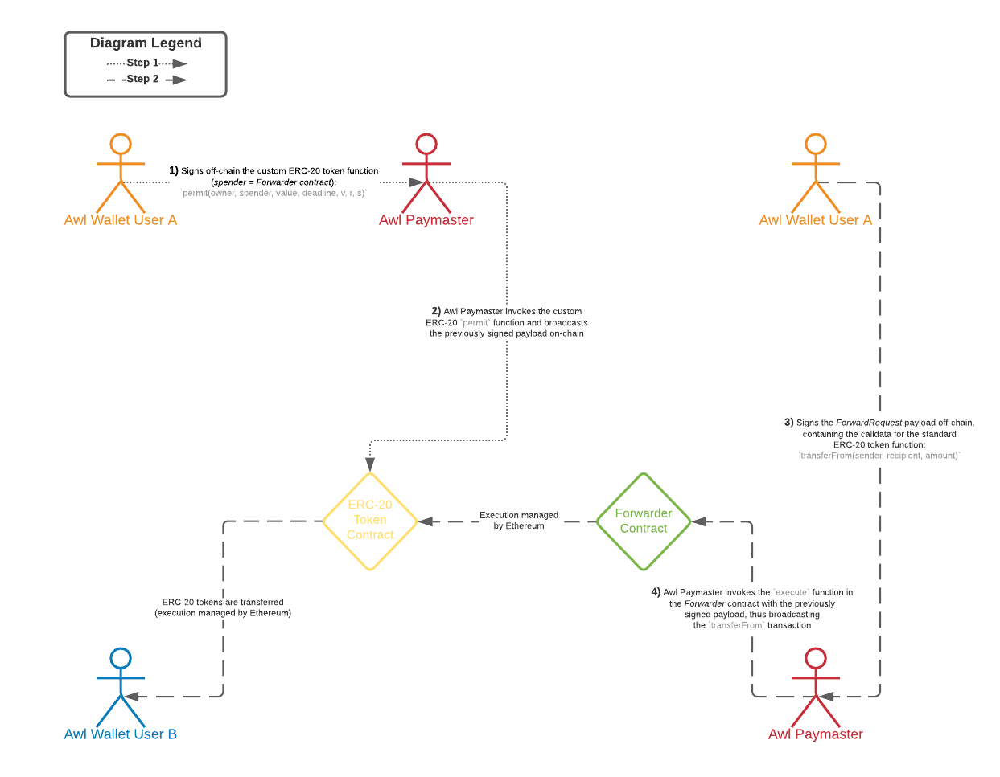

# Ethereum [`ERC-20`](https://eips.ethereum.org/EIPS/eip-20) Meta-Transaction
<figure align="center">
  
</figure>

----------------------

## Meta-Transaction - Background
A *meta-transaction* is a regular Ethereum transaction which contains another transaction, the actual transaction. The actual transaction is signed by a user and then sent to an operator (e.g. [Awl](https://appswithlove.com)) or something similar; **no gas and blockchain interaction required**. The operator takes this signed transaction and submits it to the blockchain paying for the fees himself. The contract ensures there's a valid signature on the actual transaction and then executes it.

In the context of [`ERC-20`](https://eips.ethereum.org/EIPS/eip-20) token transfers, we must also be aware of the following important governance layer: Arguably one of the main reasons for the success of [`ERC-20`](https://eips.ethereum.org/EIPS/eip-20) tokens lies in the interplay between [`approve`](https://docs.openzeppelin.com/contracts/4.x/api/token/erc20#ERC20-approve-address-uint256-) and [`transferFrom`](https://docs.openzeppelin.com/contracts/4.x/api/token/erc20#ERC20-transferFrom-address-address-uint256-), which allows for tokens to not only be transferred between [externally owned accounts](https://ethdocs.org/en/latest/contracts-and-transactions/account-types-gas-and-transactions.html) (EOA) but also to be used in other contracts under application-specific conditions by abstracting away `msg.sender` as the defining mechanism for token access control.

However, a limiting factor in this design stems from the fact that the [`ERC-20`](https://eips.ethereum.org/EIPS/eip-20) [`approve`](https://docs.openzeppelin.com/contracts/4.x/api/token/erc20#ERC20-approve-address-uint256-) function itself is defined in terms of `msg.sender`. This means that the user's initial action involving [`ERC-20`](https://eips.ethereum.org/EIPS/eip-20) tokens must be performed by an EOA. If the user needs to interact with a smart contract, then they need to make two transactions ([`approve`](https://docs.openzeppelin.com/contracts/4.x/api/token/erc20#ERC20-approve-address-uint256-) and the smart contract call which will internally call [`transferFrom`](https://docs.openzeppelin.com/contracts/4.x/api/token/erc20#ERC20-transferFrom-address-address-uint256-)). Even in the simple use case of paying another person, they need to hold ether (ETH) to pay for transaction gas costs.

To resolve this challenge, we extend all deployed [`ERC-20`](https://eips.ethereum.org/EIPS/eip-20) tokens with a new function [`permit`](https://docs.openzeppelin.com/contracts/4.x/api/token/erc20#ERC20Permit-permit-address-address-uint256-uint256-uint8-bytes32-bytes32-), which allows users to modify the allowance mapping using a signed message (via [`secp256k1`](https://en.bitcoin.it/wiki/Secp256k1) signatures), instead of through `msg.sender`. Or in other words, the [`permit`](https://docs.openzeppelin.com/contracts/4.x/api/token/erc20#ERC20Permit-permit-address-address-uint256-uint256-uint8-bytes32-bytes32-) method, which can be used to change an account's [`ERC-20`](https://eips.ethereum.org/EIPS/eip-20) allowance (see [`IERC20.allowance`](https://docs.openzeppelin.com/contracts/4.x/api/token/erc20#IERC20-allowance-address-address-)) by presenting a message signed by the account. By not relying on [`IERC20.approve`](https://docs.openzeppelin.com/contracts/4.x/api/token/erc20#IERC20-approve-address-uint256-), the token holder account doesn't need to send a transaction, and thus is not required to hold ETH at all.

For an improved user experience, the signed data is structured following [EIP-712](https://eips.ethereum.org/EIPS/eip-712), which already has wide spread adoption in major RPC & wallet providers.

This setup leads us to the following architecture:
<figure align="center">
  
</figure>

### [EIP-712](https://eips.ethereum.org/EIPS/eip-712) - Ethereum Typed Structured Data Hashing and Signing
[EIP-712](https://eips.ethereum.org/EIPS/eip-712) is a standard for hashing and signing of typed structured data.

The encoding specified in the EIP is very generic, and such a generic implementation in Solidity is not feasible, thus this contract does not implement the encoding itself. Protocols need to implement the type-specific encoding they need in their contracts using a combination of `abi.encode` and `keccak256`.

This contract implements the [EIP-712](https://eips.ethereum.org/EIPS/eip-712) domain separator ([`_domainSeparatorV4`](https://docs.openzeppelin.com/contracts/4.x/api/utils#EIP712-_domainSeparatorV4--)) that is used as part of the encoding scheme, and the final step of the encoding to obtain the message digest that is then signed via [`ECDSA`](https://docs.openzeppelin.com/contracts/4.x/api/utils#ECDSA) ([`_hashTypedDataV4`](https://docs.openzeppelin.com/contracts/4.x/api/utils#EIP712-_hashTypedDataV4-bytes32-)).

The implementation of the domain separator was designed to be as efficient as possible while still properly updating the chain id to protect against replay attacks on an eventual fork of the chain.
> This contract implements the version of the encoding known as "v4", as implemented by the JSON RPC method [`eth_signTypedDataV4` in MetaMask](https://docs.metamask.io/guide/signing-data.html#sign-typed-data-v4).

## Forwarder Contract
The smart contract [`Forwarder.sol`](https://gitlab.appswithlove.net/tooling/metatx/-/blob/main/contracts/Forwarder.sol) extends the [EIP-2770](https://eips.ethereum.org/EIPS/eip-2770) and entails the following core functions:

`verify`: Verifies the signature based on typed structured data.
```solidity
    function verify(ForwardRequest calldata req, bytes calldata signature) public view returns (bool) {
        address signer = _hashTypedDataV4(keccak256(abi.encode(
            _TYPEHASH,
            req.from,
            req.to,
            req.value,
            req.gas,
            req.nonce,
            keccak256(req.data)
        ))).recover(signature);
        return _nonces[req.from] == req.nonce && signer == req.from;
    }
```
`execute`: Executes the meta-transaction via a low-level call.
```solidity
    function execute(ForwardRequest calldata req, bytes calldata signature) public payable whenNotPaused() returns (bool, bytes memory) {
        require(_senderWhitelist[msg.sender], "AwlForwarder: sender of meta-transaction is not whitelisted");
        require(verify(req, signature), "AwlForwarder: signature does not match request");
        _nonces[req.from] = req.nonce + 1;

        (bool success, bytes memory returndata) = req.to.call{gas: req.gas, value: req.value}(abi.encodePacked(req.data, req.from));
        
        if (!success) {
            assembly {
            returndatacopy(0, 0, returndatasize())
            revert(0, returndatasize())
            }
        }

        assert(gasleft() > req.gas / 63);

        emit MetaTransactionExecuted(req.from, req.to, req.data);

        return (success, returndata);
    }
```
### UML Diagram [`Forwarder.sol`](https://gitlab.appswithlove.net/tooling/metatx/-/blob/main/contracts/Forwarder.sol) Smart Contract
<figure align="center">
  
</figure>

## Unit Tests
As the project backbone, we use the [Truffle](https://github.com/trufflesuite/truffle) development environment. However, since [Hardhat](https://hardhat.org) implements great features for Solidity debugging like Solidity stack traces, console.log, and explicit error messages when transactions fail, we leverage Hardhat for testing: 
```
npx hardhat test
```
### Test Coverage
This repository implements a test coverage plugin. Simply run
```
npx hardhat coverage --testfiles "test/Forwarder.test.js"
```
The written tests available in the file [`Forwarder.test.js`] (https://gitlab.appswithlove.net/tooling/metatx/-/blob/main/test/Forwarder.test.js) achieve a test coverage of 100%:
```
----------------|----------|----------|----------|----------|----------------|
File            |  % Stmts | % Branch |  % Funcs |  % Lines |Uncovered Lines |
----------------|----------|----------|----------|----------|----------------|
 contracts\     |      100 |      100 |      100 |      100 |                |
  Forwarder.sol |      100 |      100 |      100 |      100 |                |
----------------|----------|----------|----------|----------|----------------|
All files       |      100 |      100 |      100 |      100 |                |
----------------|----------|----------|----------|----------|----------------|
```


## Security Considerations
In order to assure a replay protection, we track on-chain a `nonce` mapping. Further, to prevent anyone from broadcasting transactions that have a potential malicious intent, the *Forwarder* contract implements a whitelist for the `execute` function.
### Remember That Ether Can Be Forcibly Sent to an Account
Beware of coding an invariant that strictly checks the balance of a contract. An attacker can forcibly send ether to any account and this cannot be prevented (not even with a fallback function that does a `revert()`). The attacker can do this by creating a contract, funding it with 1 wei, and invoking `selfdestruct(victimAddress)`. No code is invoked in `victimAddress`, so it cannot be prevented. This is also true for block reward which is sent to the address of the miner, which can be any arbitrary address. Also, since contract addresses can be precomputed, ether can be sent to an address before the contract is deployed.

## Generate the `calldata`, `signature`, `struct` Data Using `web3.js`
Run `node scripts/web3js-calldata.js` to generate the `calldata`, `signature`, `struct` data.
> `calldata` is where data from external calls to functions is stored. Functions can be called internally, e.g. from within the contract, or externally. When a function's visibility is external, only external contracts can call that function. When such an external call happens, the data of that call is stored in `calldata`.

## Test Deployments
The smart contract [`Forwarder.sol`](https://gitlab.appswithlove.net/tooling/metatx/-/blob/main/contracts/Forwarder.sol) has been deployed across all the major test networks:
- Rinkeby: [0xDA9F0524bDbc92443797feA702eDBD10A51cD3Fd](https://rinkeby.etherscan.io/address/0xDA9F0524bDbc92443797feA702eDBD10A51cD3Fd)
- Ropsten: [0xeD1d5e84F1d2947509923Ac55AEb538684015cb2](https://ropsten.etherscan.io/address/0xed1d5e84f1d2947509923ac55aeb538684015cb2)
- Kovan: [0xeb8647302b2F97653452Ce1582E046e205D515bc](https://kovan.etherscan.io/address/0xeb8647302b2F97653452Ce1582E046e205D515bc)
- Goerli: [0x20EC414D11C2C1C9c332083284C1f99C1365A645](https://goerli.etherscan.io/address/0x20EC414D11C2C1C9c332083284C1f99C1365A645) 

## References
[1] https://medium.com/coinmonks/ethereum-meta-transactions-101-de7f91884a06

[2] https://soliditydeveloper.com/meta-transactions

[3] https://docs.openzeppelin.com/contracts/4.x/api/metatx

[4] https://docs.opengsn.org

[5] https://eips.ethereum.org/EIPS/eip-2612

[6] https://eips.ethereum.org/EIPS/eip-712
