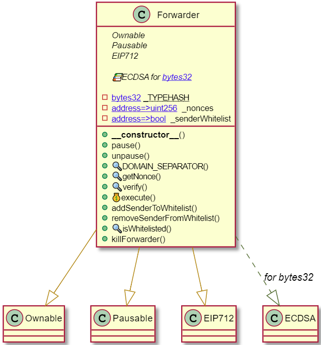

# Ethereum Meta-Transaction
<figure align="center">
  
</figure>

----------------------

## Background
A *meta-transaction* is a regular Ethereum transaction which contains another transaction, the actual transaction. The actual transaction is signed by a user and then sent to an operator (e.g. [Awl](https://appswithlove.com)) or something similar; **no gas and blockchain interaction required**. The operator takes this signed transaction and submits it to the blockchain paying for the fees himself. The contract ensures there's a valid signature on the actual transaction and then executes it:

<figure align="center">
  
  <figcaption>In the case of an <a href="https://eips.ethereum.org/EIPS/eip-20" target="_blank"><em>ERC-20</em></a> transfer, the <em>Signer</em> needs to approve the <em>Proxy</em> contract to transfer tokens on its behalf.</figcaption>
</figure>

### General High-Level Overview
If we want to support generalised meta-transactions in our contract, it can be done with a few simple steps. On a high-level, there are two steps to it.

**Step 1:** Verify the signature of the meta-transaction. We can do this by either creating a hash following the [EIP-712](https://eips.ethereum.org/EIPS/eip-712) standard and `ecrecover`:
```solidity
bool isValidSignature = ecrecover(hash(transaction), v, r, s) == transaction.signerAddress;
```
or the more *old-fashioned* way:
```solidity
bool isValidSignature = keccak256(abi.encode(transaction.parameter)).toEthSignedMessageHash().recover(signature) == transaction.signerAddress;
```

**Step 2:** Once verified, we can extract the actual transaction data. One way would be by using `delegatecall` on our current contract address, we execute a function in our current contract without doing a new contract call. Remember that `delegatecall` basically calls the contract's code but with the current contract's state. So by doing `address(this).delegatecall` we just execute all in our current contract and we can pass the transaction data along:
```solidity
(bool didSucceed, bytes memory returnData) = address(this).delegatecall(transaction.data);
```

Another approach would be to use directly the low-level call `call` with the token address (e.g. Startfeld's token address):
```solidity
(bool didSucceed, bytes memory returnData) = transaction.tokenAddress.call(transaction.data);
```

## Implementation Strategy
As already mentioned above, in the case of an [ERC-20](https://eips.ethereum.org/EIPS/eip-20) transfer, the *Signer* needs to approve the *Forwarder* contract to transfer tokens on its behalf. We now face the challenge that e.g. OpenZeppelin's [`approve`](https://github.com/OpenZeppelin/openzeppelin-contracts/blob/master/contracts/token/ERC20/ERC20.sol#L130) implementation internally sets the `msg.sender` as the owner of the function call. In our case, this would mean that the *Forwarder* contract grants itself an `allowance`.
```solidity
function approve(address spender, uint256 amount) public virtual override returns (bool) {
  _approve(_msgSender(), spender, amount);
  return true;
}
```
Also, since our deployed token contracts do not inherit from the draft version of [`permit`](https://eips.ethereum.org/EIPS/eip-2612), the only way to deal with this challenge is to ask the user for a high enough `allowance` for the *Forwarder* contract at the beginning of the user journey. In order to assure a replay protection, we track on-chain a `nonce` mapping. Further, to prevent anyone from broadcasting transactions that have a potential malicious intent, the *Forwarder* contract implements a whitelist for the `execute` function.

### UML Diagram `Forwarder` Smart Contract
<figure align="center">
  
</figure>

## Generate the `calldata`, `signature`, `struct` Data Using `web3.js`
Run `node scripts/web3js-calldata.js` to generate the `calldata`, `signature`, `struct` data.
> `calldata` is where data from external calls to functions is stored. Functions can be called internally, e.g. from within the contract, or externally. When a function's visibility is external, only external contracts can call that function. When such an external call happens, the data of that call is stored in `calldata`.

## Test Deployments
- Rinkeby Deployment `Forwarder.sol`: [0xba5b421D415054b08b7D1CeB7F0f790c35729c48](https://rinkeby.etherscan.io/address/0xba5b421D415054b08b7D1CeB7F0f790c35729c48)
  - First successful meta-transaction 😎: [0x2c5b6104c3ae092242e8f63a497111e0761c9c36785e3df8999ce7e72e918217](https://rinkeby.etherscan.io/tx/0x2c5b6104c3ae092242e8f63a497111e0761c9c36785e3df8999ce7e72e918217)
- Another Rinkeby Deployment: [0x292122Fe21Fdb9B3B84841A11fBDb574E3D09b97](https://rinkeby.etherscan.io/address/0x292122Fe21Fdb9B3B84841A11fBDb574E3D09b97);

## Tests
As the project backbone, we use the [Truffle](https://github.com/trufflesuite/truffle) development environment. However, since [Hardhat](https://hardhat.org/) implements great features for Solidity debugging like Solidity stack traces, console.log, and explicit error messages when transactions fail, we leverage Hardhat for testing: 
```
npx hardhat test
```

## TO DOS
- Discuss smart contract design;
  - Whitelisted addresses: public/private?
  - Should we allow for duplicates in the whitelist; e.g. multiple whitelisting of the same address?
  - Possibility to remove address from whitelist?
  - Prevent sending ETH to the contract (see comment below; we need to make sure no `payable` functions are included (check `killForwarder()`));
  - Whitelist allowed ERC20 tokens?
  - Prevent DDoS attack (too many sending from user, backend signature for validation?);
  - Check signer is always from address parameter of `transferFrom`;
- Elaborate on security considerations;
- Write proper unit tests;

### Remember That Ether Can Be Forcibly Sent to an Account
Beware of coding an invariant that strictly checks the balance of a contract.

An attacker can forcibly send ether to any account and this cannot be prevented (not even with a fallback function that does a `revert()`).

The attacker can do this by creating a contract, funding it with 1 wei, and invoking `selfdestruct(victimAddress)`. No code is invoked in `victimAddress`, so it cannot be prevented. This is also true for block reward which is sent to the address of the miner, which can be any arbitrary address.

Also, since contract addresses can be precomputed, ether can be sent to an address before the contract is deployed.

## References
[1] https://medium.com/coinmonks/ethereum-meta-transactions-101-de7f91884a06

[2] https://soliditydeveloper.com/meta-transactions

[3] https://docs.openzeppelin.com/contracts/4.x/api/metatx

[4] https://docs.opengsn.org/